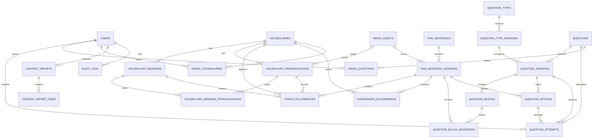

# FLEX THIA 백엔드 MVP 도메인·ERD·API 설계

- 상태: 승인됨
- 기준일: 2026-07-23
- 대상 브랜치: `feat/backend`
- 구현 범위: 설계만 수행하며 코드, DB migration, 인프라는 변경하지 않는다.

## 1. 목적

이 문서는 기존 제품 기획을 백엔드에서 구현할 수 있는 MVP 도메인 모델,
ERD, HTTP API 계약으로 구체화한다.

설계의 우선순위는 다음과 같다.

1. 태국어 문제를 풀고 즉시 상세 피드백을 받는 핵심 학습 흐름
2. 공용 어휘를 검색하고 저장하는 흐름
3. 관리자가 사람이 작성한 JSON과 준비된 음성으로 콘텐츠를 게시하는 흐름
4. 과거 풀이와 게시 콘텐츠를 안전하게 보존하는 규칙
5. 공개 가입을 두지 않는 보안 중심 인증

전체 제품의 모듈 경계와 폴더 기준은
[`docs/development/backend-architecture.md`](../../development/backend-architecture.md)를
따른다. 이 문서의 ERD와 API는 MVP에 실제로 필요한 부분만 다룬다.

## 2. 설계 기준과 확정 범위

### 2.1 기준 문서

- `docs/superpowers/specs/2026-07-16-thai-flex-learning-service-design.md`
- `docs/development/backend-architecture.md`
- `conventions/comment-convention.md`
- 루트 `AGENTS.md`
- [Amazon Cognito refresh token rotation](https://docs.aws.amazon.com/cognito/latest/developerguide/amazon-cognito-user-pools-using-the-refresh-token.html)
- [Amazon Cognito TOTP MFA](https://docs.aws.amazon.com/cognito/latest/developerguide/user-pool-settings-mfa-totp.html)

문서끼리 충돌하면 이번 세션에서 합의한 MVP 결정을 우선한다.

### 2.2 MVP에 포함

- 미리 준비된 계정의 이메일·비밀번호 로그인
- `ADMIN`, `LEARNER` 역할과 관리자 TOTP MFA
- 읽기·듣기 문제 목록, 상세, 첫 답, 재시도
- 문제 저장과 첫 답 기준 오답 필터
- `STANDARD_CHOICE`, `PASSAGE_CHOICE`, `DIALOGUE_CHOICE`
- 태국어 단어·표현·문장 해석, 한국어 발음, 성조, 준비된 음성
- 공용 어휘 검색·상세·문제 사용처
- 사용자 하나의 저장 어휘 목록
- 사람이 작성한 정규 JSON 가져오기
- 결정 규칙 검증, 초안, 관리자 게시, 숨김, 새 버전
- 관리자 콘텐츠 변경 감사 기록

### 2.3 MVP에서 보류

- 공개 회원가입과 셀프 비밀번호 재설정
- 베타 사용자 초대·관리 화면
- PDF·이미지 OCR, AI 추출·생성·교차 검증
- TTS 자동 생성과 비동기 재시도
- `INLINE_SPAN_CHOICE`
- 여러 개인 단어장과 단어 연습
- 개인 추천, 통계·숙련도 집계
- 개념 학습, 오류 신고 처리
- 유의어·반의어·관련어 편집
- 원본 자료 관리와 페이지별 처리 화면

보류 기능의 빈 폴더, 테이블, API는 미리 만들지 않는다.

## 3. 아키텍처와 도메인 경계

백엔드는 기능 우선 모듈러 모놀리스로 구성한다. MVP에서 활성화하는
도메인은 다음과 같다.

| 도메인 | 소유하는 책임 |
| --- | --- |
| `identity` | 사용자, Cognito 신원 연결, 역할, 상태, 관리자 MFA 상태 |
| `vocabulary` | 공용 어휘·표현, 뜻, 발음, 중복 방지와 게시 |
| `thai-content` | 문장 버전, 토큰 출현, 표현 범위, 문맥 피드백 |
| `media` | 변경 불가능한 음성 자산과 업로드 완료 상태 |
| `questions` | 문제 유형, 문제·버전, 블록, 선택지, 정답, 게시 |
| `learning` | 답안, 재시도, 저장 문제, 저장 어휘 |
| `content-production` | JSON 가져오기, 항목별 검증, 초안 생성 조정 |
| `operations` | 관리자 변경 감사 기록 |

`content-production`은 가져오기 작업만 소유한다. 문제의 게시 가능 여부는
`questions`, 어휘의 공개 여부는 `vocabulary`, 음성 준비 여부는 `media`가
결정한다.

모든 콘텐츠를 상속받는 범용 `Content` 모델, 기능마다 반복되는 base
repository, 도메인 이벤트 버스는 만들지 않는다.

## 4. 핵심 도메인 모델

### 4.1 사용자와 권한

`User`는 Cognito의 `sub`와 애플리케이션 내부 UUID를 연결한다.

- 역할은 `LEARNER`, `ADMIN` 두 개만 둔다.
- `ADMIN`은 모든 `LEARNER` 권한을 포함한다.
- 계정 상태는 `ACTIVE`, `DISABLED`다.
- 역할과 상태는 JWT claim을 신뢰하지 않고 요청마다 DB의 최신 값을
  사용한다.
- 관리자는 TOTP 등록을 마치기 전까지 관리자 API를 사용할 수 없다.
- 사용자는 물리 삭제하지 않고 비활성화한다.

### 4.2 어휘와 발음

`Vocabulary`는 하나의 정규화된 태국어 표기를 대표한다.

- 종류는 `WORD`, `EXPRESSION`이다.
- 같은 `normalizedThai`는 하나만 존재한다.
- 하나의 어휘는 여러 `VocabularyMeaning`과
  `VocabularyPronunciation`을 가질 수 있다.
- 뜻과 발음이 다대다인 경우
  `VocabularyMeaningPronunciation`으로 연결한다.
- 발음은 한국어 발음, 성조 표기와 준비된 단어 음성을 가진다.
- 게시된 어휘는 물리 삭제하지 않는다.
- 정확히 같은 정규화 표기는 DB 유일 제약으로 중복 생성을 막는다.

어휘 상태는 다음과 같다.

```text
DRAFT ──publish──> PUBLISHED <──restore── HIDDEN
                       │             ▲
                       └────hide─────┘
```

유사 어휘 검토와 기존 참조를 옮기는 병합은 전체 제품 기능으로 보류한다.
MVP schema에는 병합 상태나 병합 대상 컬럼을 미리 넣지 않는다.

### 4.3 태국어 문장과 출현

`ThaiSentence`는 재사용 가능한 문장의 논리적 정체성이고,
`ThaiSentenceVersion`은 실제 표시할 내용의 불변 스냅샷이다.

문장 버전은 다음을 가진다.

- 태국어 원문
- 한국어 해석
- 문장 전체 한국어 발음
- 문장 전체 성조 기호
- 준비된 문장 음성
- 순서와 원문 위치를 보존하는 토큰 출현
- 대표 다단어 표현 범위

`TokenOccurrence`는 문장 안의 단어 한 번의 출현이다. 공용 어휘, 선택된
뜻과 발음, 짧은 문맥상 뜻, 원문 범위, `TARGET`·`REQUIRED`·`SUPPORTING`
역할을 저장한다.

`ExpressionOccurrence`는 여러 토큰에 걸친 `EXPRESSION` 어휘를 연결한다.
겹치는 표현은 관리자 지정, 긴 표현, 먼저 시작하는 표현 순서로 대표
표현 하나를 결정한다.

원문 범위는 Unicode code point 기준의 시작 포함·끝 제외 offset으로
통일한다. 가져오기 검증은 모든 범위가 원문과 일치하고 서로 복원 가능한지
확인한다.

문장 버전은 문제 게시 시 함께 동결한다. 동결된 문장을 고치려면 새 문장
버전을 만든다.

### 4.4 문제, 버전, 블록

문제 구조는 다음과 같다.

```text
QuestionType
└─ QuestionTypeVersion

Question
└─ QuestionVersion
   ├─ QuestionBlock[]
   │  └─ ThaiSentenceVersion[]
   ├─ QuestionOption[]
   │  └─ ThaiSentenceVersion
   └─ correct option
```

- `QuestionType`은 세부 출제 유형의 논리적 정체성이다.
- `QuestionTypeVersion`은 템플릿, 선택지 수와 결정 규칙을 고정한다.
- `Question`은 같은 문제라는 정체성과 현재 공개 버전을 관리한다.
- `QuestionVersion`은 실제 출제 내용의 스냅샷이다.
- `QuestionBlock`은 `INSTRUCTION`, `PASSAGE`, `DIALOGUE`, `QUESTION`,
  `EXPLANATION` 중 하나이며 표시 순서를 가진다.
- 블록은 문장 버전을 순서대로 연결한다. 대화 블록의 문장 연결에는 화자
  이름을 둘 수 있다.
- `QuestionOption`은 선택지 순서와 문장 버전을 가진다.
- 정답 여부는 관리자 응답과 풀이 제출 결과 외에는 공개하지 않는다.

MVP 템플릿은 다음 세 가지다.

| 템플릿 | 구조 |
| --- | --- |
| `STANDARD_CHOICE` | 문제 설명·질문·선택지 |
| `PASSAGE_CHOICE` | 지문 하나·질문 하나·선택지 |
| `DIALOGUE_CHOICE` | 화자별 대화·질문 하나·선택지 |

문제 그룹과 공유 지문은 만들지 않는다. 한 화면은 문제 하나를 표시한다.

### 4.5 문제 상태와 버전 상태

문제의 노출 상태와 버전의 수명은 분리한다.

`Question.status`:

```text
DRAFT ──first publish──> PUBLISHED <──restore── HIDDEN
                             │             ▲
                             └────hide─────┘
```

`QuestionVersion.status`:

```text
DRAFT ──publish──> PUBLISHED ──new version publish──> RETIRED
                        │
                        └────content defect──> INVALIDATED
```

버전 검증 상태는 수명 상태와 별도로 `PENDING`, `PASSED`, `FAILED`를
사용한다.

- 초안은 수정할 수 있으며 수정하면 검증 상태가 `PENDING`으로 돌아간다.
- 게시된 버전은 수정하지 않는다.
- 게시된 문제를 수정하면 현재 버전을 복사한 새 초안을 만든다.
- 새 버전 게시와 이전 버전 `RETIRED` 전이는 한 transaction에서 처리한다.
- 단순 숨김은 현재 버전을 무효화하지 않으므로 복구할 수 있다.
- 정답 오류 같은 내용 결함은 해당 버전을 `INVALIDATED`로 만들고 문제를
  즉시 숨긴다.
- 무효 버전의 기존 답안은 보존하되 오답 필터와 미래 통계에서 제외한다.

게시 전에는 다음을 모두 확인한다.

1. 최신 결정 규칙 검증이 `PASSED`다.
2. 유형 버전의 템플릿과 선택지 수를 만족한다.
3. 정답 선택지가 정확히 하나다.
4. 모든 원문·토큰·표현 offset이 일치한다.
5. 모든 참조 어휘가 게시 가능 상태다.
6. 모든 태국어 문장과 발음의 음성 자산이 `READY`다.

### 4.6 음성 자산

`MediaAsset`은 S3 객체 하나를 나타낸다.

- 상태는 `UPLOADING`, `READY`, `REJECTED`다.
- 지원하는 MVP 종류는 `AUDIO`뿐이다.
- MIME type, 크기, SHA-256, storage key를 검증한다.
- `READY` 자산은 덮어쓰지 않는다. 새 음성은 새 자산으로 만든다.
- 같은 SHA-256의 준비된 음성은 재사용할 수 있다.
- JSON은 공개 URL이나 S3 key가 아니라 `mediaAssetId`를 참조한다.

### 4.7 학습 기록

`QuestionAttempt`는 append-only다.

- 실제로 푼 `QuestionVersion`과 선택한 `QuestionOption`을 참조한다.
- 같은 논리 문제에 대한 제출 순서를 `attemptNo`로 저장한다.
- `attemptNo = 1`이 첫 답이며 이후 제출은 재시도다.
- 재시도는 첫 답을 덮어쓰지 않는다.
- `clientAttemptId`로 네트워크 재전송을 멱등 처리한다.
- 정답 여부와 제출 당시 소요 시간을 원시 기록으로 저장한다.
- 답안 수정·삭제 API는 제공하지 않는다.
- 집계·숙련도 테이블은 만들지 않는다.

`SavedQuestion`과 `SavedVocabulary`는 사용자와 대상의 유일한 연결이다.
MVP는 이름을 가진 여러 단어장을 만들지 않는다.

### 4.8 JSON 가져오기

`ContentImport`는 관리자가 제출한 정규 JSON 묶음 한 번을 나타낸다.
`ContentImportItem`은 묶음 안의 개별 어휘 또는 문제다.

처리는 다음 순서를 따른다.

1. 요청 전체 JSON schema가 잘못됐으면 아무것도 저장하지 않고 `400`을
   반환한다.
2. 정상 요청은 `ContentImport`를 하나 만든다.
3. 어휘 항목을 먼저 처리한다.
4. 각 항목을 독립 transaction으로 검증하고 초안으로 저장한다.
5. 실패 항목은 오류 경로와 코드를 저장하고 다음 항목 처리를 계속한다.
6. 문제는 성공한 어휘와 준비된 음성 자산만 참조할 수 있다.
7. 가져오기 성공은 게시를 의미하지 않는다.

가져오기 상태는 `COMPLETED`, `COMPLETED_WITH_FAILURES`다. MVP 처리는
동기식이며 기존 `Job`과 queue를 사용하지 않는다.

## 5. MVP ERD

다음 ERD는 논리 관계를 나타낸다. 실제 Drizzle schema 이름은 복수형
snake case를 사용한다.



### 5.1 핵심 테이블

| 테이블 | 주요 데이터 |
| --- | --- |
| `users` | Cognito sub, email, role, status, TOTP 등록 시각 |
| `vocabularies` | 표시 표기, 정규화 표기, 종류, 상태 |
| `vocabulary_meanings` | 한국어 뜻, 품사, 난이도, 문맥 설명 |
| `vocabulary_pronunciations` | 한국어 발음, 성조, 음성 자산 |
| `vocabulary_meaning_pronunciations` | 뜻과 발음 연결 |
| `media_assets` | 종류, storage key, MIME, 크기, SHA-256, 상태 |
| `thai_sentences` | 문장 논리 ID |
| `thai_sentence_versions` | 버전 번호, 원문, 번역, 발음, 성조, 음성, 동결 시각 |
| `token_occurrences` | 순서, 원문 범위, 어휘·뜻·발음, 문맥 뜻, 역할 |
| `expression_occurrences` | 토큰 범위, 표현 어휘, 대표 여부 |
| `question_types` | 세부 유형 slug, 표시 이름, 읽기·듣기 분류 |
| `question_type_versions` | 버전, 템플릿, 선택지 수, 결정 규칙 |
| `questions` | 상태, 현재 게시 버전 |
| `question_versions` | 버전, 유형 버전, 난이도, 상태, 검증 결과, 게시 시각 |
| `question_blocks` | 블록 종류, 표시 방식, 순서 |
| `question_block_sentences` | 블록 안 문장 순서와 선택적 화자 |
| `question_options` | 선택지 순서, 문장 버전, 정답 여부 |
| `question_attempts` | 사용자, 문제·버전, 제출 순서, 선택지, 정답 여부 |
| `saved_questions` | 사용자와 문제 연결 |
| `saved_vocabularies` | 사용자와 어휘 연결 |
| `content_imports` | 요청자, 멱등 key, 상태, 항목 수 |
| `content_import_items` | 원본 순서, 종류, 상태, 대상 ID, 오류 |
| `audit_logs` | 행위자, 행위, 대상, 변경 요약, request ID |

### 5.2 DB 무결성 규칙

- `users.cognito_sub`, `users.email`은 각각 유일하다.
- `vocabularies.normalized_thai`는 유일하다.
- 문장·문제·유형 버전 번호는 부모 안에서 유일하다.
- 블록, 블록 문장, 선택지의 순서는 부모 안에서 유일하다.
- 게시 가능한 선택형 문제는 정답 선택지가 정확히 하나다. DB의 정답
  중복 방지 제약과 게시 transaction의 개수 검사를 함께 사용한다.
- 현재 게시 버전은 같은 문제에 속해야 한다. 문제 ID를 포함한 composite
  FK로 다른 문제의 버전을 가리키지 못하게 한다.
- 답안의 선택지는 답안이 참조하는 문제 버전에 속해야 한다. 문제 버전
  ID를 포함한 composite FK로 교차 참조를 막는다.
- 토큰이 참조하는 뜻과 발음은 같은 공용 어휘에 속해야 한다. 어휘 ID를
  포함한 composite FK 또는 같은 수준의 DB 제약으로 보장한다.
- 사용자와 문제의 `(user_id, question_id, attempt_no)`는 유일하다.
- 사용자와 `(client_attempt_id)`는 유일하여 재전송이 답안을 늘리지 않는다.
- 저장 문제와 저장 어휘는 각각 `(user_id, target_id)`가 유일하다.
- 가져오기는 `(requested_by, idempotency_key)`가 유일하다.
- 게시된 문제 버전, 동결 문장 버전, `READY` 음성 자산은 update하지 않는다.
- 학습 기록과 감사 기록은 물리 삭제하거나 update하지 않는다.
- 콘텐츠 참조 FK는 기본적으로 `RESTRICT`를 사용한다. 초안 폐기는
  application transaction에서 자식 범위를 명시적으로 확인한다.

## 6. 인증과 HTTP 공통 정책

### 6.1 인증 흐름

1. 계정은 Cognito와 관리자 bootstrap 절차로 미리 준비한다.
2. 브라우저가 API에 이메일과 비밀번호를 전송한다.
3. API가 Cognito 인증 결과를 중계한다.
4. 관리자는 Cognito TOTP challenge를 완료해야 token을 받는다.
5. access JWT는 응답 body로 전달하고 프론트 메모리에만 둔다.
6. refresh token은 API host 전용 HttpOnly cookie에 둔다.
7. API Gateway와 API guard가 access token을 검증하고 DB 역할과 상태를
   다시 확인한다.

MVP에는 회원가입과 비밀번호 재설정 API가 없다. 비밀번호 분실은 관리자가
Cognito 운영 절차로 처리한다.

### 6.2 Token과 cookie

- access token: Cognito JWT, 15분
- refresh token: 7일, rotation과 logout revoke 사용
- rotation: Cognito `GetTokensFromRefreshToken`, 재전송을 위한 10초 grace
  period, 프론트의 단일 refresh 요청 사용
- cookie 이름: `__Host-flex-thia-refresh`
- cookie 속성: `Secure`, `HttpOnly`, `SameSite=Strict`, `Path=/`, `Domain`
  미설정
- access token은 `localStorage`, `sessionStorage`, IndexedDB에 저장하지
  않는다.
- 로그아웃은 refresh token을 revoke하고 동일 속성으로 cookie를 지운다.
- Cognito의 device remembering은 사용하지 않는다.

### 6.3 CORS와 CSRF

- 운영 CORS는 정확한 프론트 origin 하나만 허용한다.
- `Access-Control-Allow-Credentials: true`를 사용하고 wildcard origin은
  사용하지 않는다.
- cookie를 사용하는 로그인, MFA, refresh, logout 요청은 허용된
  `Origin`과 `X-CSRF-Protection: 1`을 모두 요구한다.
- 개발 환경은 Vite HTTPS proxy로 `/api`를 API에 전달해 브라우저 기준
  same-origin으로 사용한다.
- 운영의 `www`와 `api` 하위 도메인은 cross-origin이지만 same-site다.

### 6.4 관리자 MFA

- 관리자 역할은 TOTP 등록이 필수다.
- 첫 등록 전에는 `/me`와 TOTP 설정 API만 사용할 수 있다.
- 등록은 Cognito `AssociateSoftwareToken`, `VerifySoftwareToken`,
  `SetUserMFAPreference` 순서로 완료하고 성공 뒤에만
  `mfaEnrolledAt`을 기록한다.
- TOTP secret과 challenge는 로그에 남기지 않는다.
- SMS step-up, 신뢰 기기, 복구 코드는 MVP에서 구현하지 않는다.
- 로그인 실패와 MFA 실패는 계정 존재 여부를 드러내지 않는 공통 오류를
  사용하고 rate limit을 적용한다.

### 6.5 API 표현 규칙

- base path: `/api/v1`
- JSON 필드: `camelCase`
- ID: UUID 문자열
- 시각: UTC ISO 8601 문자열
- enum: `UPPER_SNAKE_CASE`
- 목록: `page`, `pageSize`를 사용하는 페이지 번호 방식
- 쓰기 요청의 body는 `shared/contracts`의 Zod schema로 검증한다.
- DB row와 도메인 객체를 HTTP 응답으로 직접 반환하지 않는다.
- 학습자 응답은 정답, 내부 검증 결과, storage key를 노출하지 않는다.

공통 오류는 `application/problem+json`을 사용한다.

```json
{
  "type": "https://flex-thia.example/problems/content-state-conflict",
  "title": "현재 상태에서 요청을 처리할 수 없습니다.",
  "status": 409,
  "code": "QUESTION_VERSION_NOT_PUBLISHABLE",
  "requestId": "request-id",
  "fieldErrors": []
}
```

주요 상태 코드는 다음과 같다.

| 상태 | 사용 |
| --- | --- |
| `400` | JSON·query·path schema 오류 |
| `401` | token 없음·만료·잘못된 자격 증명 |
| `403` | 역할, MFA, CSRF 조건 실패 |
| `404` | 존재하지 않거나 현재 사용자에게 공개되지 않은 자원 |
| `409` | 현재 도메인 상태와 충돌, 중복 멱등 key payload |
| `413` | 허용 크기를 넘는 JSON 또는 음성 |
| `429` | 로그인·가져오기 rate limit |

## 7. 인증 API

| Method | Path | 권한 | 설명 |
| --- | --- | --- | --- |
| `POST` | `/auth/login` | 공개+CSRF | 비밀번호 로그인 또는 MFA challenge 시작 |
| `POST` | `/auth/mfa/totp/challenge` | 공개+CSRF | 로그인 TOTP challenge 완료 |
| `POST` | `/auth/mfa/totp/setup` | 인증 | 관리자 TOTP 등록 정보 생성 |
| `POST` | `/auth/mfa/totp/setup/verify` | 인증 | 등록 TOTP 확인 |
| `POST` | `/auth/refresh` | refresh cookie+CSRF | access token 갱신과 refresh rotation |
| `POST` | `/auth/logout` | refresh cookie+CSRF | refresh revoke와 cookie 삭제 |
| `GET` | `/me` | 인증 | 현재 사용자, 역할, MFA 상태 조회 |

로그인 성공 응답:

```json
{
  "status": "AUTHENTICATED",
  "accessToken": "jwt",
  "expiresIn": 900,
  "user": {
    "id": "uuid",
    "email": "user@example.com",
    "role": "ADMIN",
    "mfaEnrolled": true
  }
}
```

관리자 MFA가 필요한 로그인 응답:

```json
{
  "status": "MFA_REQUIRED",
  "challengeToken": "opaque-cognito-session"
}
```

TOTP 로그인 challenge 요청은 최초 로그인에 사용한 `email`, Cognito가
반환한 `challengeToken`, 인증 앱의 6자리 `code`를 받는다. TOTP 설정
시작은 Cognito가 만든 `secretCode`를 반환하고, 설정 확인은 현재 access
token과 6자리 `code`로 완료한다.

## 8. 학습자 API

모든 학습자 API는 인증된 `LEARNER` 또는 `ADMIN`만 사용할 수 있다.
`ADMIN`은 별도 계정 전환 없이 자신의 학습 기록을 만든다.

### 8.1 문제

| Method | Path | 설명 |
| --- | --- | --- |
| `GET` | `/questions` | 공개 문제 목록과 필터 |
| `GET` | `/questions/{questionId}` | 현재 게시 버전 문제 상세 |
| `POST` | `/questions/{questionId}/attempts` | 첫 답 또는 재시도 제출 |
| `GET` | `/me/question-attempts` | 내 원시 풀이 기록 조회 |
| `PUT` | `/me/saved-questions/{questionId}` | 문제 저장, 멱등 |
| `DELETE` | `/me/saved-questions/{questionId}` | 문제 저장 해제, 멱등 |

문제 목록 query:

- `skill=READING|LISTENING`
- `questionTypeId`
- `difficulty`
- `saved=true|false`
- `firstResult=CORRECT|INCORRECT|UNANSWERED`
- `page`, `pageSize`

문제 상세는 `questionId`, `questionVersionId`, 유형, 난이도, 표시 방식,
블록, 선택지, 문장 피드백, 음성 URL, 저장 여부를 반환한다. 정답과 해설은
답 제출 전 응답에 포함하지 않는다.

답안 요청:

```json
{
  "questionVersionId": "uuid",
  "selectedOptionId": "uuid",
  "clientAttemptId": "uuid",
  "durationMs": 18400
}
```

답안 응답:

```json
{
  "attempt": {
    "id": "uuid",
    "attemptNo": 1,
    "isFirst": true,
    "isCorrect": false,
    "selectedOptionId": "uuid",
    "submittedAt": "2026-07-23T00:00:00.000Z"
  },
  "feedback": {
    "correctOptionId": "uuid",
    "explanationBlocks": []
  }
}
```

같은 `clientAttemptId`를 같은 payload로 다시 보내면 기존 응답을 반환한다.
다른 payload로 재사용하면 `409`다. 숨겨졌거나 무효화된 버전에 새 답을
제출하면 `409 QUESTION_UNAVAILABLE`을 반환한다.

듣기 대본은 사용자가 제출 전에 직접 공개할 수 있으므로 문제 상세에
포함하되 `displayMode`에 따라 프론트가 가린다. 대본 공개 행동은 저장하지
않는다.

### 8.2 어휘

| Method | Path | 설명 |
| --- | --- | --- |
| `GET` | `/vocabularies` | 공용 어휘·표현 검색 |
| `GET` | `/vocabularies/{vocabularyId}` | 뜻·발음·음성·예문 상세 |
| `GET` | `/vocabularies/{vocabularyId}/questions` | 해당 어휘가 나온 게시 문제 |
| `GET` | `/me/saved-vocabularies` | 저장한 어휘 목록 |
| `PUT` | `/me/saved-vocabularies/{vocabularyId}` | 어휘 저장, 멱등 |
| `DELETE` | `/me/saved-vocabularies/{vocabularyId}` | 어휘 저장 해제, 멱등 |

검색 query는 `query`, `kind`, `partOfSpeech`, `difficulty`, `page`,
`pageSize`를 지원한다. 태국어 검색은 정규화 표기, 한국어 검색은 뜻과
한국어 발음을 대상으로 한다.

## 9. 관리자 API

모든 관리자 API는 `ADMIN`, `ACTIVE`, TOTP 등록을 요구하고 변경 작업을
감사 기록에 남긴다.

### 9.1 JSON 가져오기

| Method | Path | 설명 |
| --- | --- | --- |
| `POST` | `/admin/content-imports` | 정규 JSON을 항목별 초안으로 가져오기 |
| `GET` | `/admin/content-imports` | 가져오기 이력 |
| `GET` | `/admin/content-imports/{importId}` | 항목별 성공·실패와 오류 |

`POST`는 UUID 형식의 `Idempotency-Key` header를 요구한다. 한 요청은
어휘와 문제를 합쳐 최대 100개 항목으로 제한한다.

```json
{
  "schemaVersion": 1,
  "vocabularies": [],
  "questions": []
}
```

문제 항목은 `clientRef`로 같은 요청의 어휘를 참조하거나 이미 존재하는
`vocabularyId`를 참조한다. 모든 태국어 문장에는 원문, 번역, 전체 발음,
성조, token·표현 offset, `mediaAssetId`가 포함돼야 한다.

정규 JSON의 논리 계약은 다음과 같다. `Ref`는 `id`와 `clientRef` 중
정확히 하나만 허용한다.

```text
ContentImportRequest
├─ schemaVersion: 1
├─ vocabularies: VocabularyInput[]
│  ├─ clientRef
│  ├─ thai, kind
│  ├─ meanings[]
│  │  └─ clientRef, meaningKo, partOfSpeech, difficulty?, contextNote?
│  └─ pronunciations[]
│     └─ clientRef, pronunciationKo, toneMarks, mediaAssetId
└─ questions: QuestionInput[]
   ├─ clientRef, questionTypeSlug, questionTypeVersion, difficulty
   ├─ blocks[]
   │  └─ kind, displayMode, sentences[]
   │     └─ speaker?, sentence: SentenceInput
   ├─ options[]
   │  └─ clientRef, position, sentence: SentenceInput
   └─ correctOptionRef

SentenceInput
├─ originalText, translationKo, pronunciationKo, toneMarks, mediaAssetId
├─ tokens[]
│  └─ surface, startOffset, endOffset, vocabulary: Ref,
│     meaning: Ref, pronunciation: Ref, contextMeaningKo, role
└─ expressions[]
   └─ startTokenIndex, endTokenIndex, vocabulary: Ref, representative?
```

`questionTypeSlug`와 `questionTypeVersion`은 서버가 미리 등록한 유형 버전을
가리킨다. `displayMode`는 `TEXT`, `AUDIO`, `TEXT_AND_AUDIO`,
`AUDIO_THEN_REVEAL` 중 하나다. `difficulty`는 1에서 5 사이의 정수다.
문제 템플릿과 선택지 수는 클라이언트 입력이 아니라 유형 버전에서
결정한다.

응답은 전체 상태와 각 원본 index의 `IMPORTED`, `REJECTED`, 대상 ID,
구조화된 오류를 반환한다. 한 항목의 실패는 다른 정상 항목을 rollback하지
않는다.

### 9.2 문제 관리

| Method | Path | 설명 |
| --- | --- | --- |
| `GET` | `/admin/questions` | 모든 상태의 문제 목록 |
| `GET` | `/admin/questions/{questionId}` | 버전과 검증 결과 상세 |
| `POST` | `/admin/questions/{questionId}/versions` | 현재 버전을 복사해 새 초안 생성 |
| `PUT` | `/admin/question-versions/{versionId}` | 초안 전체를 정규 payload로 교체 |
| `POST` | `/admin/question-versions/{versionId}/validate` | 결정 규칙 검증 |
| `POST` | `/admin/question-versions/{versionId}/publish` | 검증된 초안 게시 |
| `POST` | `/admin/question-versions/{versionId}/invalidate` | 내용 결함 버전 무효화 |
| `POST` | `/admin/questions/{questionId}/hide` | 문제 즉시 숨김 |
| `POST` | `/admin/questions/{questionId}/restore` | 유효한 현재 버전 복구 |

이미 게시된 버전에 `PUT`하면 `409 IMMUTABLE_VERSION`을 반환한다. 검증
실패는 HTTP 실패로 처리하지 않고 `200`과 `PASSED` 또는 `FAILED` 보고서를
반환한다.

### 9.3 어휘 관리

| Method | Path | 설명 |
| --- | --- | --- |
| `GET` | `/admin/vocabularies` | 모든 상태의 어휘 목록 |
| `GET` | `/admin/vocabularies/{vocabularyId}` | 뜻·발음·사용처 상세 |
| `PUT` | `/admin/vocabularies/{vocabularyId}` | 어휘와 하위 정보 검증 후 교체 |
| `POST` | `/admin/vocabularies/{vocabularyId}/publish` | 음성이 준비된 어휘 게시 |
| `POST` | `/admin/vocabularies/{vocabularyId}/hide` | 어휘 숨김 |
| `POST` | `/admin/vocabularies/{vocabularyId}/restore` | 어휘 복구 |

병합은 참조 이동 범위와 운영 검증이 더 필요하므로 MVP API와 ERD에서
보류한다. 정확 중복은 `normalizedThai` 유일 제약으로 차단한다.

### 9.4 음성 자산

| Method | Path | 설명 |
| --- | --- | --- |
| `POST` | `/admin/media-assets/audio-upload-requests` | 검증된 presigned upload 요청 |
| `POST` | `/admin/media-assets/{mediaAssetId}/complete` | S3 객체 크기·MIME·hash 확인 |
| `GET` | `/admin/media-assets/{mediaAssetId}` | 준비 상태와 사용처 조회 |

업로드 요청은 파일명, MIME type, 크기, SHA-256을 받는다. 완료 전 자산은
콘텐츠 초안에 연결할 수 있지만 게시 조건을 충족하지 않는다.

## 10. Transaction과 동시성

다음 작업은 반드시 하나의 DB transaction으로 처리한다.

- 새 문제 버전 게시, 기존 버전 퇴역, 현재 게시 버전 교체
- 문제 버전 무효화와 문제 숨김
- 첫 답 또는 다음 재시도 번호 결정과 답안 저장
- 가져오기 항목 하나의 검증된 초안 저장
- 관리자 변경과 해당 감사 기록 저장

답안과 가져오기에는 클라이언트 멱등 ID를 사용한다. 상태 전이는 update
조건에 기대 상태를 함께 넣어 동시 요청 하나만 성공하게 한다. 충돌은
조용히 덮어쓰지 않고 `409`로 반환한다.

## 11. 기존 코드 판정

현재 코드는 전체 설계가 확정되기 전에 만든 기반이므로 파일 존재만으로
도메인 설계가 완성됐다고 보지 않는다.

### 11.1 유지

| 현재 요소 | 판정 근거 |
| --- | --- |
| `users`의 Cognito sub, role, status | 새 identity 모델과 일치 |
| `LEARNER`, `ADMIN`, `ACTIVE`, `DISABLED` enum | 확정 역할·상태와 일치 |
| access token claim 확인 후 DB 사용자를 조회하는 guard 개념 | JWT보다 최신 역할·상태를 사용 |
| exact Origin과 custom header를 확인하는 CSRF guard 개념 | 확정 CSRF 정책과 일치 |
| `CurrentUser` decorator와 역할 metadata | 전달 계층 책임으로 적절 |
| Cognito provider port·adapter 분리 | 외부 기술을 domain 밖에 둠 |
| fake provider와 repository | 로컬·단위 테스트에 필요 |
| 태국어 검색 정규화 함수와 테스트 | 어휘 중복·검색의 기반 |
| domain exception filter, 구조화 logger | 공통 오류·운영 관찰 기반 |
| DB client, migration 실행, readiness | 기능 도메인과 독립된 기반 |
| health endpoint와 환경 변수 Zod 검증 | 운영 기반으로 유지 |
| append-only `audit_logs` 개념 | operations 도메인과 일치 |

유지는 현재 파일과 schema를 그대로 고정한다는 뜻이 아니라 책임과 핵심
동작을 재사용한다는 뜻이다.

### 11.2 수정

| 현재 요소 | 필요한 수정 |
| --- | --- |
| `auth` 폴더와 domain 이름 | 최종적으로 `identity` 경계 안에 정리 |
| `PasswordAuthService` | 미리 준비된 계정의 login·refresh·logout 중심으로 축소 |
| `AuthController` | 공개 signup, signup verify, forgot/reset endpoint 제거 |
| refresh cookie | 30일·`Lax`에서 7일·`Strict`·`__Host-` 정책으로 변경 |
| Cognito refresh | rotation 활성화 전제와 새 refresh token cookie 교체 보장 |
| `ApplicationRoleGuard` | 정확히 같은 역할 비교 대신 `ADMIN`이 `LEARNER`를 포함 |
| 관리자 추가 인증 | 전화번호·SMS가 아니라 Cognito TOTP 등록과 challenge 사용 |
| `users` schema | `mfa_enrolled_at` 추가, 이메일 정규화 정책 명시 |
| `audit_logs` schema | 내부 actor user ID, target type·ID를 구조화 |
| `shared/contracts` | controller inline type 대신 모든 공개 계약을 Zod로 이동 |
| provider 폴더 | 범용 `aws`가 아니라 `identity`, `storage`, `queue` 능력별 정리 |
| 업로드 provider | 입력 자료 업로드와 게시 음성 업로드 책임을 분리 |
| bootstrap admin command | Cognito 사전 계정과 DB `ADMIN` 연결, TOTP 등록 전 상태 반영 |

### 11.3 보류

| 현재 요소 | 이유 |
| --- | --- |
| `authChallenges`, 이메일 challenge, SES 발송 | 공개 가입·셀프 재설정이 MVP에서 제외 |
| 전화번호 확인 Controller·provider | 전화번호 인증이 MVP에서 제외 |
| SMS step-up challenge·grant | 관리자 인증을 TOTP로 변경 |
| `uploads` 입력 자료 schema와 API | PDF·이미지 입력을 보류하고 음성 업로드는 별도 모델 사용 |
| `jobs`, `jobItems`, `providerRuns` | AI·PDF·TTS 비동기 자동화를 보류 |
| jobs Controller·service와 worker foundation task | 같은 이유로 MVP 실행 경로에서 제외 |
| SQS queue와 AI 작업 fake | 미래 자동화 단계에서 재검토 |

보류 대상은 이번 설계 작업에서 삭제하거나 migration으로 제거하지 않는다.
실제 구현 계획에서 의존 관계를 확인한 뒤 단계적으로 격리한다.

### 11.4 재검토 필요

- 현재 API Lambda의 NestJS dependency injection metadata 문제는 배포
  트러블슈팅 범위이며 이 설계와 분리한다.
- 현재 `audit_logs.actor_sub`와 자유 형식 `target`은 새 조회·무결성
  요구를 충족하는지 migration 전에 검토한다.
- 현재 Cognito app client와 API Gateway authorizer가 refresh rotation,
  TOTP challenge, 15분 access token을 실제로 지원하도록 설정됐는지는
  인프라 작업 재개 시 확인한다.
- 기존 `jobs` aggregate가 미래 `content-production`에 그대로 맞는지는
  PDF·AI 자동화 설계 시 다시 판단한다.

## 12. 오류 처리와 로그

- domain은 안정적인 오류 code를 만들고 HTTP filter가 상태 코드와 problem
  response로 변환한다.
- 예상 가능한 입력·상태 오류는 error log로 남기지 않는다.
- 예상하지 못한 오류는 request ID, route, 사용자 ID만 구조화해 기록한다.
- token, cookie, 비밀번호, TOTP, 원문 전체 JSON은 로그에 남기지 않는다.
- 관리자 변경 감사 기록은 요청 성공 transaction 안에서만 추가한다.
- 외부 Provider 오류는 내부 상세를 숨기고 안정적인 code로 변환한다.

## 13. 검증 전략

프로젝트 지침에 따라 브라우저·API E2E 테스트는 추가하지 않는다.

- domain 단위 테스트: 게시 조건, 상태 전이, 첫 답·재시도, 멱등 처리
- contract 테스트: 정상·잘못된 JSON, 공개 응답에서 정답·내부 필드 제외
- guard 단위 테스트: 역할 상속, 비활성 사용자, MFA, CSRF
- repository 테스트: unique constraint, 조건부 상태 변경, transaction 경계
- schema 테스트: FK와 enum, append-only 대상의 mutation 경로 부재
- 정적 검증: lint, typecheck, build

테스트의 `describe`, `it`, `test` 설명은 한국어로 작성하고 변경하는
export에는 주석 컨벤션을 적용한다.

## 14. 구현 순서 제안

이 문서가 승인된 뒤 별도 구현 계획에서 다음 순서를 사용한다.

1. contracts 공통 오류·페이지 계약과 identity 정리
2. 어휘·문장·media schema와 domain
3. 문제·버전·게시 domain
4. 학습 기록과 문제 풀이 API
5. 어휘 조회·저장 API
6. 음성 업로드와 JSON 가져오기
7. 관리자 검증·게시 API
8. 기존 signup·SMS·Job 경로 격리

각 단계는 필요한 schema와 migration만 추가하며 미래 모듈의 빈 코드는
만들지 않는다.

## 15. 완료 기준

- MVP 포함·보류 기능이 API와 ERD에서 모순되지 않는다.
- 게시된 문제 버전과 과거 풀이가 수정으로 손상되지 않는다.
- 첫 답과 재시도를 원시 기록으로 재현할 수 있다.
- 정답은 답 제출 전 학습자 API에 노출되지 않는다.
- 사람이 작성한 JSON의 항목별 실패가 다른 정상 항목을 막지 않는다.
- 관리자 MFA, token 저장, cookie, CORS, CSRF 정책이 일관된다.
- 기존 코드를 유지·수정·보류·재검토 대상으로 판정할 수 있다.
- PDF·AI·TTS 자동화 없이도 준비된 JSON과 음성으로 핵심 학습 흐름을
  운영할 수 있다.
